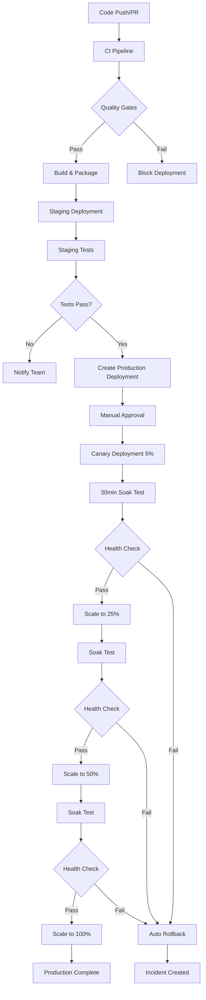

# Deployment Pipeline Architecture

This document describes the comprehensive, production-ready deployment pipeline for the Salunga AI project.

## Architecture Overview

The deployment pipeline follows a **secure, multi-stage, canary deployment strategy** with comprehensive monitoring, automated rollbacks, and strong security practices.



## Pipeline Components

### 1. Continuous Integration (`ci.yml`)

**Purpose**: Quality assurance and fast feedback
**Triggers**: Push to main, Pull Requests

#### Stages:
1. **Static Analysis** (2-3 min)
   - Rust formatting (`cargo fmt`)
   - Clippy linting (`cargo clippy`)  
   - Security audit (`cargo audit`)
   - Frontend linting (ESLint, TypeScript)

2. **Unit Tests** (5-10 min)
   - Backend unit tests with smart test runner
   - Frontend unit tests with coverage
   - Coverage threshold enforcement (85% backend, 80% frontend)

3. **Integration Tests** (10-15 min)
   - Database integration tests
   - Service-to-service communication tests
   - Contract tests against OpenAPI specs

4. **Build Verification** (5-10 min)
   - Full compilation test
   - Docker image builds
   - Artifact generation

**Quality Gates**: All stages must pass before merge

### 2. Staging Deployment (`main.yml`)

**Purpose**: Automated staging deployment with comprehensive testing
**Triggers**: Push to main branch, Manual dispatch

#### Stages:
1. **Pre-deployment Checks** (3-5 min)
   - Change detection (backend/frontend)
   - Previous run failure recovery
   - Quick smoke tests

2. **Build & Package** (10-15 min)
   - Production-ready builds
   - SBOM generation
   - Artifact storage

3. **Staging Deployment** (15-20 min)
   - Consolidated API Gateway deployment
   - Frontend deployment to Vercel
   - Environment-specific configuration

4. **Regression Testing** (20-25 min)
   - Deployment readiness validation
   - E2E smoke tests with Playwright
   - API integration testing
   - Performance benchmarking
   - SLA compliance verification

5. **Production Deployment Request**
   - Automatic deployment object creation
   - Pending approval status

**Quality Gates**: All tests must pass to create production deployment

### 3. Production Canary Deployment (`deploy.yml`)

**Purpose**: Safe, progressive production deployment with monitoring
**Triggers**: Production deployment events, Manual dispatch

#### Progressive Rollout Strategy:
1. **5% Canary** → 30min soak test → Health validation
2. **25% Traffic** → 30min soak test → Health validation  
3. **50% Traffic** → 30min soak test → Health validation
4. **100% Traffic** → Deployment complete

#### Monitoring & Validation:
- Continuous health monitoring during soak tests
- Error rate threshold monitoring (1% above baseline)
- Latency SLA enforcement (20% above baseline)
- Resource utilization monitoring (CPU <80%, Memory <85%)
- Automatic rollback on failure

### 4. Emergency Rollback (`rollback.yml`)

**Purpose**: Fast, reliable rollback capability
**Triggers**: Manual dispatch only

#### Capabilities:
- **Scope Selection**: All services, backend only, frontend only, canary only
- **Version Selection**: Previous stable or specific version
- **Enhanced Error Handling**: Retry logic, detailed diagnostics
- **Verification**: Multi-attempt health checks
- **Incident Management**: Automatic issue creation

### 5. Continuous Monitoring (`deployment-monitor.yml`)

**Purpose**: 24/7 health monitoring and alerting
**Triggers**: Scheduled (5min during business hours, 15min off-hours)

#### Monitoring Scope:
- **Production Health**: All services, response times, error rates
- **Staging Health**: Basic availability monitoring  
- **Performance SLAs**: Response time thresholds, success rates
- **Security Health**: Certificate expiry, DNS resolution

#### Alerting:
- Automatic incident creation on failures
- Performance SLA violation tracking
- Team notification (Slack/email integration ready)

### 6. Security & Secrets Management (`secrets-management.yml`)

**Purpose**: Security scanning and secrets validation
**Triggers**: Daily scheduled, Manual dispatch

#### Security Scanning:
- **Dependency Vulnerabilities**: Rust cargo audit, npm audit
- **Infrastructure Scanning**: Workflow security analysis  
- **Secret Validation**: Required secrets presence check
- **Git History Analysis**: Basic secret leak detection

## Architecture Decisions

### 1. Consolidated API Gateway

**Decision**: Single consolidated API Gateway instead of individual microservices
**Rationale**:
- Simplified deployment pipeline (1 service vs 5+)
- Reduced operational complexity
- Better resource utilization
- Consistent routing and authentication
- Easier monitoring and logging

**Implementation**:
- Single Shuttle deployment (`api-gateway`)
- Internal service routing (`/api/v1/projects/*`, `/api/v1/backlog/*`, etc.)
- Shared database and authentication

### 2. Canary Deployment Strategy

**Decision**: Progressive traffic splitting with automated monitoring
**Rationale**:
- Minimal blast radius for issues
- Automated rollback on failures  
- Gradual confidence building
- Real user traffic validation

**Implementation**:
- 5% → 25% → 50% → 100% progression
- 30-minute soak tests at each stage
- Comprehensive health monitoring
- Automatic rollback triggers

### 3. Environment Segregation

**Decision**: Clear staging/production environment separation
**Rationale**:
- Risk isolation
- Configuration consistency
- Proper testing flow
- Compliance requirements

**Implementation**:
- Separate Shuttle projects
- Environment-specific secrets
- Different Clerk tenants
- Independent monitoring

### 4. Comprehensive Testing Strategy

**Decision**: Multi-layered testing approach
**Rationale**:
- Early issue detection
- Confidence in deployments
- Regression prevention
- Performance validation

**Testing Layers**:
1. Unit tests (fast feedback)
2. Integration tests (service interactions)
3. Contract tests (API compliance)
4. E2E tests (user journeys)
5. Performance tests (SLA compliance)

## Security Best Practices

### 1. Secrets Management
- GitHub Secrets for sensitive data
- Environment-specific secret scoping
- Regular rotation schedule
- Automatic validation
- No secrets in code/logs

### 2. Access Control
- Least privilege principle
- Environment protection rules
- Required approvals for production
- Audit logging
- Team-based permissions

### 3. Security Scanning
- Daily dependency vulnerability scans
- Workflow security analysis
- Container image scanning (when applicable)
- Git history monitoring
- Automated security notifications

### 4. Network Security
- HTTPS enforcement
- Proper certificate management
- DNS security validation
- API authentication required
- Rate limiting implementation

## Operational Procedures

### 1. Normal Deployment Flow
1. Developer creates PR
2. CI pipeline runs automatically
3. After PR merge, staging deployment triggers
4. Staging tests must pass
5. Manual approval for production
6. Canary deployment with progressive rollout
7. Monitoring confirms success

### 2. Emergency Procedures
1. **Issue Detection**: Monitoring alerts or manual reporting
2. **Assessment**: Determine severity and impact
3. **Decision**: Fix forward vs rollback
4. **Execution**: Emergency rollback workflow
5. **Verification**: Confirm services restored
6. **Incident Management**: Create issue, notify team
7. **Post-Incident**: Root cause analysis, prevention measures

### 3. Maintenance Windows
1. **Scheduled Maintenance**: Use staging deployment to test changes
2. **Security Updates**: Expedited pipeline with reduced soak times
3. **Infrastructure Changes**: Coordinated with monitoring system
4. **Database Migrations**: Include in deployment pipeline

## Performance & SLA Targets

### Response Time SLAs
- **Health Endpoints**: <1 second (99th percentile)
- **API Endpoints**: <2 seconds (95th percentile) 
- **Frontend Load**: <3 seconds (90th percentile)

### Availability Targets
- **Production API**: 99.9% uptime
- **Production Frontend**: 99.9% uptime
- **Staging Services**: 95% uptime

### Deployment Metrics
- **CI Pipeline**: <20 minutes total
- **Staging Deployment**: <30 minutes end-to-end
- **Production Deployment**: <2 hours total (including soak tests)
- **Emergency Rollback**: <10 minutes

## Monitoring & Observability

### Key Metrics
1. **Deployment Success Rate**: >99%
2. **Mean Time to Recovery (MTTR)**: <15 minutes
3. **Mean Time to Detection (MTTD)**: <5 minutes
4. **Deployment Frequency**: Multiple per day capability
5. **Change Failure Rate**: <5%

### Dashboards
- Real-time service health
- Deployment pipeline status
- Performance metrics
- Error rates and trends
- Resource utilization

### Alerting Rules
- Service health failures
- SLA violations
- Deployment failures
- Security issues
- Resource exhaustion

## Compliance & Governance

### Documentation Requirements
- [ ] All pipeline changes documented
- [ ] Security procedures updated
- [ ] Secrets rotation schedules maintained
- [ ] Incident response plans current
- [ ] Disaster recovery procedures tested

### Audit Requirements
- All deployment activities logged
- Secret access tracked
- Change approval workflows
- Security scan results archived
- Performance metrics retained

### Change Management
- Pipeline changes require review
- Security updates have expedited process
- Emergency procedures documented
- Regular testing of rollback procedures
- Post-incident reviews mandatory

---

## Quick Reference

### Pipeline Workflows
- **CI**: `.github/workflows/ci.yml` - Quality gates and testing
- **Staging**: `.github/workflows/main.yml` - Automated staging deployment
- **Production**: `.github/workflows/deploy.yml` - Canary production deployment
- **Rollback**: `.github/workflows/rollback.yml` - Emergency rollback procedures
- **Monitoring**: `.github/workflows/deployment-monitor.yml` - Continuous health monitoring
- **Security**: `.github/workflows/secrets-management.yml` - Security scanning and secrets validation

### Key Commands
```bash
# Manual staging deployment
gh workflow run main.yml --ref main

# Manual production deployment  
gh workflow run deploy.yml --ref main -f deployment_target=canary -f traffic_percentage=5

# Emergency rollback
gh workflow run rollback.yml --ref main -f rollback_target=all -f reason="Service outage"

# Security scan
gh workflow run secrets-management.yml --ref main

# Check monitoring status
gh workflow run deployment-monitor.yml --ref main -f environment=production -f detailed_check=true
```

This architecture provides a robust, secure, and scalable deployment pipeline that supports rapid development while maintaining high reliability and security standards.